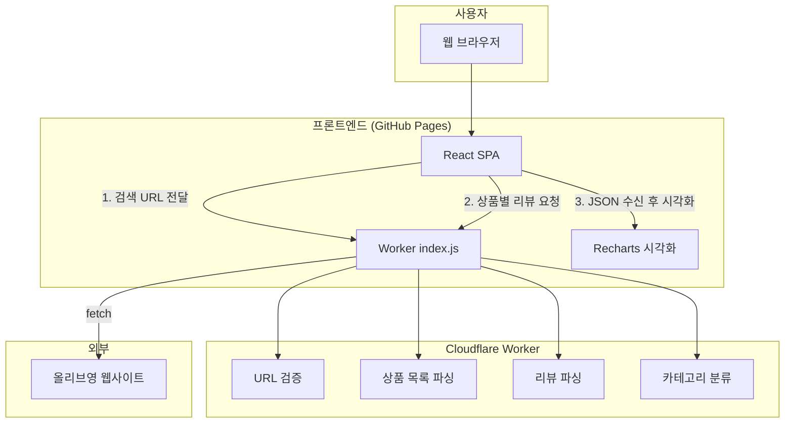
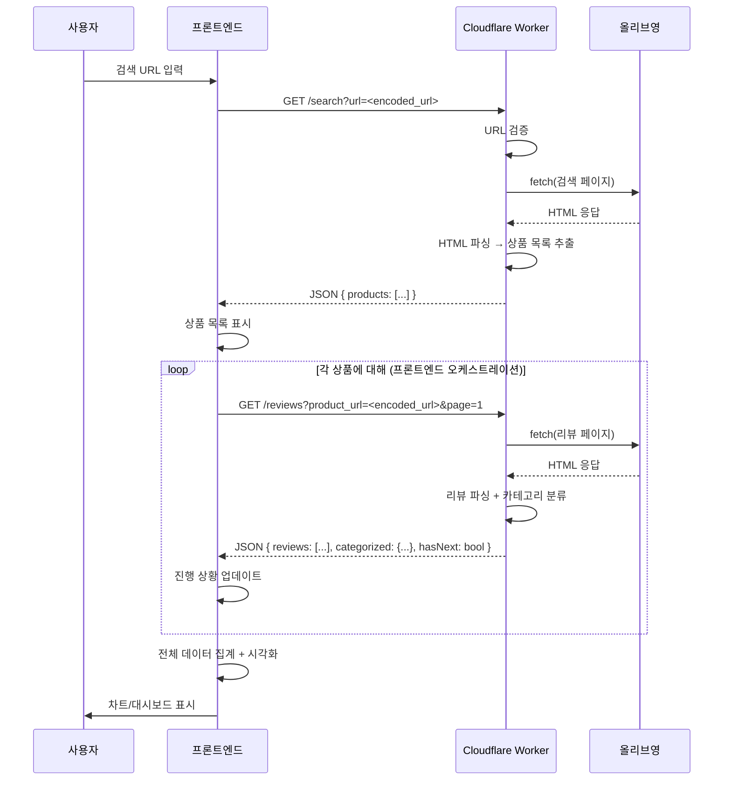
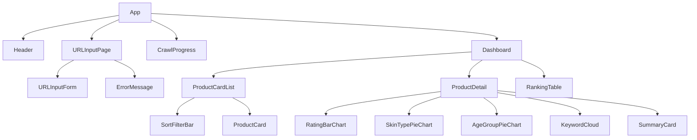

# 설계 문서: 올리브영 리뷰 크롤러

## 개요

올리브영 검색 결과 URL을 입력받아 상품 리뷰를 크롤링하고, 카테고리별로 분류하여 시각화하는 웹 애플리케이션의 설계 문서이다.

시스템은 두 부분으로 구성된다:
1. **Cloudflare Worker** — CORS 프록시 + 크롤러. 프론트엔드 요청을 받아 올리브영 페이지를 fetch하고, HTML을 파싱하여 JSON 데이터를 반환한다.
2. **프론트엔드 (React + Vite + Tailwind)** — GitHub Pages 배포. Worker API를 호출하여 크롤링 데이터를 받고, Recharts로 시각화한다.

별도의 백엔드 서버는 없으며, Worker가 모든 서버사이드 로직(HTML 페칭, 파싱, 속도 제한)을 처리한다.

### 주요 설계 결정

| 결정 사항 | 선택 | 근거 |
|-----------|------|------|
| 서버사이드 플랫폼 | Cloudflare Worker (JavaScript) | 무료 티어, 글로벌 엣지 배포, CORS 프록시 역할 가능 |
| HTML 파싱 | HTMLRewriter / regex | Worker 환경에서 사용 가능, DOM 파서 불필요 |
| 프론트엔드 프레임워크 | React + Vite + Tailwind | 빠른 빌드, 참조 프로젝트와 동일 스택 |
| 차트 라이브러리 | Recharts | React 네이티브, 참조 프로젝트에서 검증됨 |
| 배포 (프론트엔드) | GitHub Pages + GitHub Actions | 무료, 자동 배포, 참조 프로젝트 패턴 |
| 배포 (Worker) | `wrangler deploy` | Cloudflare CLI, 간단한 배포 |
| Worker URL 주입 | `VITE_WORKER_URL` 환경 변수 | 빌드 시 주입, GitHub Secrets에 등록 |
| 통신 방식 | REST (Worker) + 프론트엔드 오케스트레이션 | Worker는 stateless, 프론트엔드가 순차 호출 관리 |

### Cloudflare Worker 제약 사항

| 제약 | 무료 티어 | 유료 티어 |
|------|-----------|-----------|
| CPU 시간 | 10ms/요청 | 50ms/요청 |
| 서브리퀘스트 | 50개/호출 | 1000개/호출 |
| 메모리 | 128MB | 128MB |

→ 대량 크롤링(상품 수 많을 때)은 프론트엔드에서 여러 Worker 호출로 분할하여 처리한다.

## 아키텍처



### 데이터 흐름



## 컴포넌트 및 인터페이스

### Worker 엔드포인트

```
GET /search?url=<encoded_oliveyoung_search_url>
  - URL 검증 후 검색 결과 페이지 크롤링
  - Response: { products: Product[], totalPages: number }
  - Error: { error: string }

GET /reviews?product_url=<encoded_product_url>&page=<number>
  - 특정 상품의 리뷰 페이지 크롤링
  - Response: { reviews: Review[], categorized: CategorizedData, hasNext: boolean }
  - Error: { error: string }

GET /health
  - Worker 상태 확인
  - Response: { status: "ok", timestamp: string }
```

### Worker 모듈 구조 (`worker/index.js`)

| 함수 | 책임 |
|------|------|
| `handleSearch(url)` | 검색 URL 검증 + 상품 목록 파싱 |
| `handleReviews(productUrl, page)` | 리뷰 페이지 파싱 + 분류 |
| `validateUrl(url)` | 올리브영 도메인/경로 검증 |
| `parseProducts(html)` | 검색 결과 HTML에서 상품 정보 추출 |
| `parseReviews(html)` | 리뷰 HTML에서 리뷰 데이터 추출 |
| `categorizeReviews(reviews)` | 평점/피부타입/연령대별 분류 |
| `extractKeywords(reviews)` | 리뷰 본문에서 빈도 기반 키워드 추출 |
| `corsHeaders()` | CORS 응답 헤더 생성 |

### 프론트엔드 컴포넌트 구조



### 프론트엔드 서비스 레이어

| 모듈 | 책임 |
|------|------|
| `services/workerApi.ts` | Worker API 호출 (VITE_WORKER_URL 사용) |
| `services/crawlOrchestrator.ts` | 순차 크롤링 오케스트레이션, 진행 상황 관리 |
| `utils/sorting.ts` | 상품 정렬 (평점순, 리뷰 수순, 가격순) |
| `utils/filtering.ts` | 리뷰 필터링 (피부타입, 연령대) |
| `utils/stats.ts` | 평균 평점 계산, 통계 집계 |
| `hooks/useCrawl.ts` | 크롤링 상태 관리 커스텀 훅 |

## 데이터 모델

### Product (상품)

```typescript
interface Product {
  id: string;
  name: string;
  brand: string;
  price: number;
  url: string;
  imageUrl?: string;
  averageRating: number;
  totalReviews: number;
}
```

### Review (리뷰)

```typescript
interface Review {
  productId: string;
  rating: number;        // 1-5
  nickname: string;
  date: string;          // ISO 8601
  body: string;
  skinType?: SkinType;
  ageGroup?: AgeGroup;
}

type SkinType = '건성' | '지성' | '복합성' | '민감성' | '중성';
type AgeGroup = '10대' | '20대' | '30대' | '40대' | '50대 이상';
```

### CategorizedData (분류된 데이터)

```typescript
interface CategorizedData {
  byRating: Record<number, Review[]>;       // 1-5 키
  bySkinType: Record<SkinType, Review[]>;
  byAgeGroup: Record<AgeGroup, Review[]>;
}
```

### Keyword (키워드)

```typescript
interface Keyword {
  word: string;
  count: number;
  weight: number;  // 정규화된 가중치 (0-1)
}
```

### CrawlState (프론트엔드 크롤링 상태)

```typescript
interface CrawlState {
  status: 'idle' | 'validating' | 'crawling_products' | 'crawling_reviews' | 'completed' | 'error';
  products: Product[];
  reviews: Map<string, Review[]>;
  categorized: Map<string, CategorizedData>;
  keywords: Map<string, Keyword[]>;
  progress: {
    phase: string;
    current: number;
    total: number;
  };
  error?: string;
}
```

## 정확성 속성 (Correctness Properties)

*속성(Property)이란 시스템의 모든 유효한 실행에서 참이어야 하는 특성 또는 동작을 의미한다.*

### Property 1: URL 검증 정확성

*For any* URL 문자열에 대해, Worker의 URL Validator는 `oliveyoung.co.kr` 도메인의 검색 결과 페이지 형식(`/store/search/getSearchMain.do` 경로 포함)인 경우에만 유효하다고 판정해야 한다.

**Validates: Requirements 1.2, 1.4**

### Property 2: 상품 파싱 완전성

*For any* 올리브영 검색 결과 HTML 구조에서, Worker의 파서는 각 Product_Card로부터 상품명, 브랜드명, 가격, 상세 페이지 URL을 모두 추출해야 하며, 추출된 필드 중 누락된 것이 없어야 한다.

**Validates: Requirements 2.1**

### Property 3: 리뷰 파싱 완전성

*For any* 올리브영 리뷰 HTML 구조에서, Worker의 파서는 각 리뷰로부터 평점, 작성자 닉네임, 작성일, 리뷰 본문을 모두 추출해야 하며, 피부타입과 연령대는 존재하는 경우 추출해야 한다.

**Validates: Requirements 3.2**

### Property 4: 크롤링 내결함성

*For any* 상품 목록에서 일부 상품 페이지에 접근할 수 없는 경우, 시스템은 접근 가능한 나머지 모든 상품의 데이터를 정상적으로 수집해야 한다.

**Validates: Requirements 2.4, 3.5**

### Property 5: 리뷰 분류 정확성

*For any* 리뷰 데이터 집합에 대해, 각 리뷰는 자신의 평점/피부타입/연령대 속성에 해당하는 카테고리 버킷에 정확히 포함되어야 하며, 다른 버킷에는 포함되지 않아야 한다.

**Validates: Requirements 4.1, 4.2, 4.3**

### Property 6: 리뷰 데이터 직렬화 왕복

*For any* 유효한 분류된 리뷰 데이터에 대해, JSON으로 직렬화한 후 역직렬화하면 원본과 동일한 데이터를 복원해야 한다.

**Validates: Requirements 4.5**

### Property 7: 키워드 추출 빈도 정확성

*For any* 리뷰 본문 집합에서, 추출된 키워드의 빈도(count)는 해당 키워드가 실제로 등장한 횟수와 일치해야 한다.

**Validates: Requirements 4.4**

### Property 8: 상품 정렬 정확성

*For any* 상품 목록에 대해, 평점순 정렬 시 각 상품의 평균 평점은 이전 상품의 평균 평점 이하여야 하며, 리뷰 수순/가격순 정렬도 동일한 단조 감소(또는 증가) 조건을 만족해야 한다.

**Validates: Requirements 6.3, 5.6**

### Property 9: 리뷰 필터링 정확성

*For any* 리뷰 집합과 필터 조건(피부타입 또는 연령대)에 대해, 필터링 결과의 모든 리뷰는 해당 필터 조건을 만족해야 한다.

**Validates: Requirements 6.4**

### Property 10: Worker 응답 형식 일관성

*For any* Worker 요청에 대해, 성공 시 올바른 JSON 구조를 반환하고, 실패 시 `{ error: string }` 형식의 오류 응답을 반환해야 한다.

**Validates: Requirements 7.4**

### Property 11: 크롤링 한도 준수

*For any* 크롤링 세션에서, 처리되는 상품 수는 최대 100개를 초과하지 않아야 하며, 각 상품의 리뷰 페이지는 최대 10페이지까지만 수집해야 한다.

**Validates: Requirements 3.3, 8.5**

### Property 12: 평균 평점 계산 정확성

*For any* 리뷰 집합에 대해, 계산된 평균 평점은 모든 리뷰 평점의 합을 리뷰 수로 나눈 값과 동일해야 한다.

**Validates: Requirements 5.5**

## 오류 처리

### 오류 유형 및 처리 전략

| 오류 유형 | 발생 위치 | 처리 방식 | 사용자 메시지 |
|-----------|-----------|-----------|---------------|
| 잘못된 URL | Worker | 400 응답 | "올리브영 검색 결과 페이지 URL만 입력 가능합니다" |
| URL 접근 불가 | Worker | 502 응답 | "해당 URL에 접근할 수 없습니다. URL을 확인해 주세요" |
| 개별 상품 접근 실패 | 프론트엔드 | 건너뛰기 | 진행 상황에 스킵 카운트 표시 |
| Worker 접근 불가 | 프론트엔드 | 재시도 안내 | "서비스에 일시적으로 접근할 수 없습니다. 잠시 후 다시 시도해 주세요" |
| 올리브영 서버 오류 | Worker | 502 응답 | "올리브영 서버에서 오류가 발생했습니다" |
| Worker CPU 시간 초과 | Worker | 자동 종료 | 프론트엔드에서 재시도 또는 분할 요청 |

### 프론트엔드 오케스트레이션 전략

Worker의 서브리퀘스트 제한(무료 50개)을 고려하여:
- 상품 목록 크롤링: 1회 Worker 호출로 처리
- 리뷰 크롤링: 상품별로 개별 Worker 호출 (프론트엔드에서 순차 실행)
- 각 호출 사이에 딜레이를 두어 올리브영 서버 부하 방지
- 실패한 상품은 건너뛰고 나머지 계속 처리

### 그레이스풀 디그레이데이션

- 일부 상품 크롤링 실패 시: 성공한 상품만으로 결과 생성
- 일부 리뷰 필드 누락 시: 해당 필드를 `null`로 처리, "미분류" 카테고리로 포함
- 키워드 추출 실패 시: 키워드 섹션 숨김, 나머지 시각화는 정상 표시

## 테스트 전략

### 이중 테스트 접근법

이 프로젝트는 **단위 테스트**와 **속성 기반 테스트(Property-Based Testing)**를 병행한다.

### 속성 기반 테스트 (Property-Based Testing)

- **라이브러리**: `fast-check` (Worker + 프론트엔드 모두 JavaScript/TypeScript)
- **최소 반복 횟수**: 각 속성 테스트당 100회 이상
- **태그 형식**: `Feature: oliveyoung-review-crawler, Property {number}: {property_text}`

#### Worker 로직 테스트 (JavaScript + fast-check)

| 속성 | 테스트 대상 | 생성기 |
|------|-------------|--------|
| Property 1 | `validateUrl()` | 랜덤 URL 문자열 (유효/무효 올리브영 URL) |
| Property 2 | `parseProducts()` | 랜덤 상품 카드 HTML 구조 |
| Property 3 | `parseReviews()` | 랜덤 리뷰 HTML 구조 |
| Property 5 | `categorizeReviews()` | 랜덤 리뷰 데이터 집합 |
| Property 6 | JSON serialize/deserialize | 랜덤 분류 데이터 |
| Property 7 | `extractKeywords()` | 랜덤 텍스트 집합 |
| Property 10 | Worker 응답 핸들러 | 랜덤 요청 파라미터 |

#### 프론트엔드 테스트 (TypeScript + fast-check)

| 속성 | 테스트 대상 | 생성기 |
|------|-------------|--------|
| Property 8 | `sortProducts()` | 랜덤 상품 배열 |
| Property 9 | `filterReviews()` | 랜덤 리뷰 배열 + 랜덤 필터 |
| Property 11 | `crawlOrchestrator` 한도 로직 | 랜덤 상품 수 |
| Property 12 | `calculateAverageRating()` | 랜덤 평점 배열 |

### 단위 테스트 (Example-Based)

- Worker: URL 검증 엣지 케이스, HTML 파싱 스냅샷 테스트
- 프론트엔드: 컴포넌트 렌더링, API 호출 모킹, 에러 상태 표시

### 테스트 환경

- **Worker**: Vitest (worker 로직을 순수 함수로 분리하여 테스트)
- **프론트엔드**: Vitest + @testing-library/react + fast-check
- **CI**: GitHub Actions에서 자동 실행
